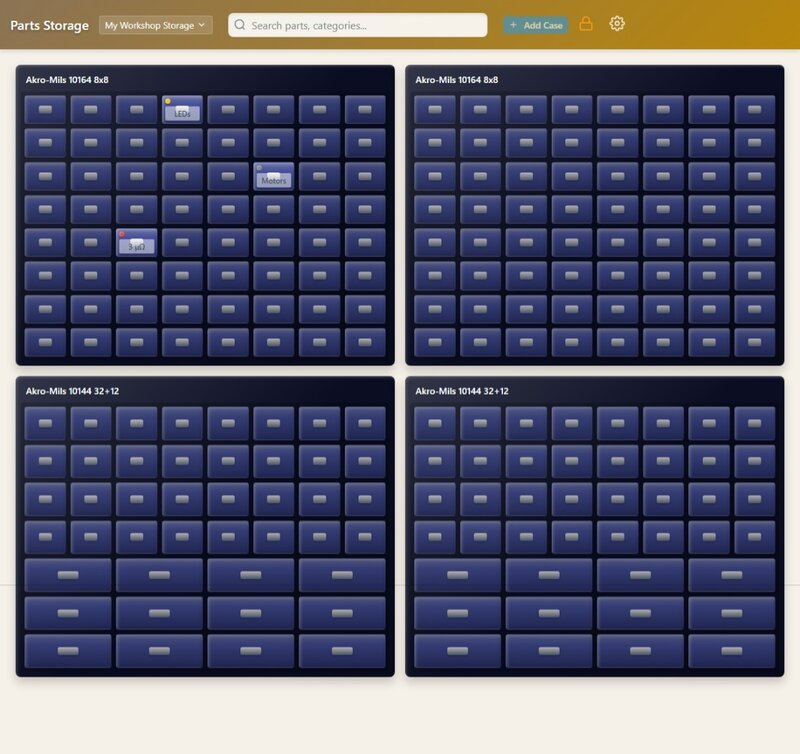
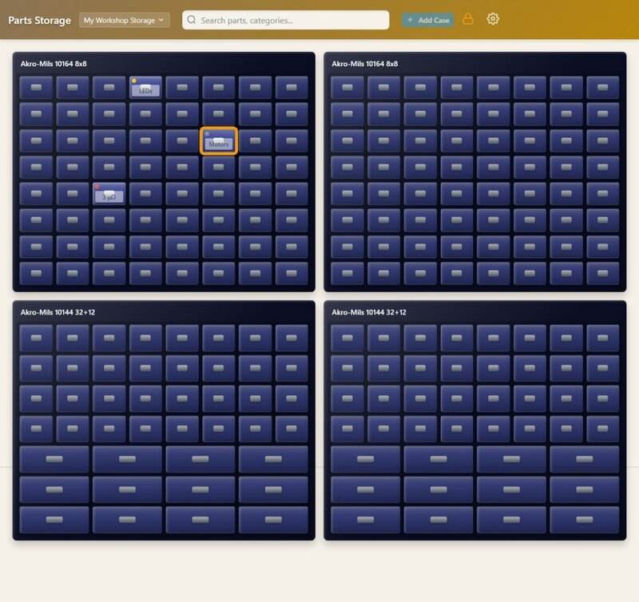

# Parts Storage Manager

A web-based inventory management system for organizing small parts and components in physical storage drawers. Features a skeuomorphic, grid-based interface that visually mimics real storage furniture—walls containing cases containing drawers.

Perfect for electronics hobbyists, makers, and anyone who needs to track where their small parts are stored.

## Features

- **Hierarchical Organization**: Walls → Cases → Drawers → Parts
- **Visual Grid Layout**: Drag-and-drop interface that mirrors physical storage
- **Full-Text Search**: Quickly find parts across your entire inventory with fuzzy matching
- **Real-Time Updates**: Changes sync instantly across all open browsers via Server-Sent Events
- **Categories & Tags**: Color-coded categories for easy visual identification
- **Layout Templates**: Save and reuse drawer configurations
- **Part Links**: Attach URLs (datasheets, purchase links) to parts
- **MCP Integration**: AI assistant support via Model Context Protocol

## Screenshots

**Wall View** - Visual grid layout showing storage cases with drawers



**Search** - Full-text search with fuzzy matching across all parts


**Drawer Highlighting** - Select a search result to show the containing drawer



## Quick Start with Docker

The easiest way to run Parts Storage Manager is with Docker Compose.

### Building and Running

1. **Clone the repository**:
   ```bash
   git clone https://github.com/yourusername/parts-storage.git
   cd parts-storage
   ```

2. **Build and start the containers**:
   ```bash
   docker compose up -d --build
   ```

3. **Access the application**:
   - **Web Interface**: http://localhost:3002
   - **MCP Server**: http://localhost:3003 (for AI integration)

### Data Persistence

Your data is stored in a Docker volume named `parts-storage-data`. This persists across container restarts and rebuilds. The SQLite database is located at `/app/data/storage.db` inside the container.

To backup your data:

```bash
docker compose exec parts-storage cp /app/data/storage.db /app/data/storage.db.backup
docker compose cp parts-storage-data:/app/data/storage.db.backup ./storage.db.backup
```

## Configuration

The Docker container uses sensible defaults, but you can customize behavior with environment variables in `docker-compose.yml`:

| Variable | Default | Description |
|----------|---------|-------------|
| `PORT` | `3002` | Main API and web server port |
| `MCP_PORT` | `3003` | MCP server port |


## MCP Server Integration

The MCP (Model Context Protocol) server allows AI assistants like Claude to interact with your parts inventory. It exposes tools for searching, listing, and managing your storage.

### Connecting Claude Desktop

Add this to your Claude Desktop configuration (`~/.config/claude/claude_desktop_config.json` on Linux):

```json
{
  "mcpServers": {
    "parts-storage": {
      "type": "http",
      "url": "http://localhost:3003/mcp"
    }
  }
}
```

Or if using the HTTP transport directly, configure your MCP client to connect to:
- **URL**: `http://localhost:3003/mcp`
- **Transport**: Streamable HTTP

### Available MCP Tools

The MCP server provides tools for:
- Searching parts across your inventory
- Listing and viewing walls, cases, drawers, and parts
- Creating and updating inventory items
- Moving parts between drawers
- Managing categories and tags
- Applying layout templates

## API Reference

The REST API is available at `http://localhost:3002/api/v1/`.

### Endpoints

| Method | Endpoint | Description |
|--------|----------|-------------|
| GET | `/walls` | List all walls |
| GET | `/walls/:id` | Get wall with cases and drawers |
| POST | `/walls` | Create a wall |
| PUT | `/walls/:id` | Update a wall |
| DELETE | `/walls/:id` | Delete a wall |
| GET | `/cases/:id` | Get case with drawers |
| POST | `/cases` | Create a case |
| PUT | `/cases/:id` | Update a case |
| DELETE | `/cases/:id` | Delete a case |
| GET | `/drawers/:id` | Get drawer with parts |
| POST | `/drawers` | Create a drawer |
| PUT | `/drawers/:id` | Update a drawer |
| DELETE | `/drawers/:id` | Delete a drawer |
| GET | `/parts` | List all parts |
| POST | `/parts` | Create a part |
| PUT | `/parts/:id` | Update a part |
| DELETE | `/parts/:id` | Delete a part |
| GET | `/categories` | List categories |
| GET | `/search?q=query` | Search parts |
| GET | `/events` | SSE stream for real-time updates |


## Development

For local development without Docker, you'll need Node.js 22+:

```bash
# Install dependencies
npm install

# Run in development mode (hot reload)
npm run dev

# Access at http://localhost:5173
```

